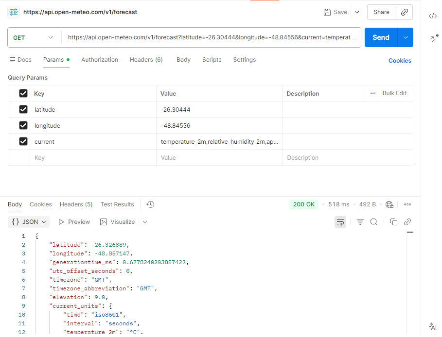
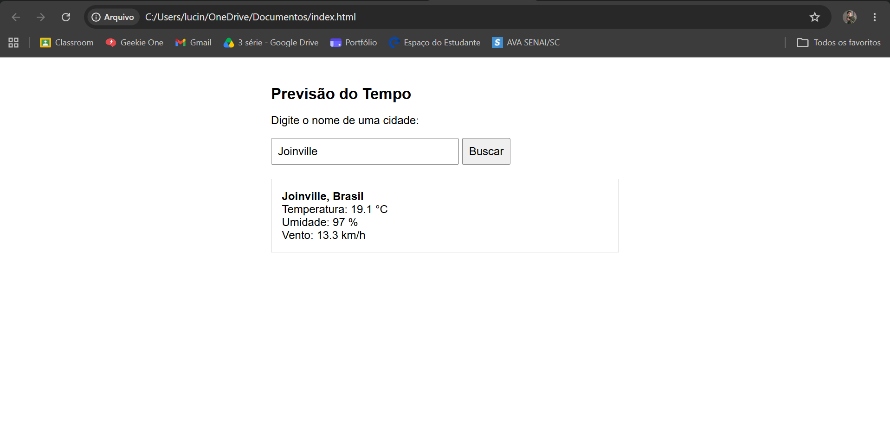

# Climoscópio

Página que busca uma cidade e mostra a previsão do tempo atual, usando Open-Meteo.

## 1. Qual API foi usada
Open-Meteo — documentação em https://open-meteo.com/en/docs (previsão) e https://open-meteo.com/en/docs/geocoding-api (busca de cidade)

## 2. O que ela devolve
A busca de cidade devolve uma **lista** de lugares que combinam com o nome digitado (nome, país, estado/região, latitude e longitude). A previsão devolve um **objeto único** com temperatura, sensação térmica, umidade, vento, precipitação e o código da condição do tempo.

## 3. Endereço que a página chama
`https://geocoding-api.open-meteo.com/v1/search?name=Joinville&count=5&language=pt`
seguido de
`https://api.open-meteo.com/v1/forecast?latitude=-26.30&longitude=-48.85&current=temperature_2m,relative_humidity_2m,apparent_temperature,precipitation,weather_code,wind_speed_10m`

## 4. Como rodar
Basta abrir o arquivo `index.html` em qualquer navegador. Não precisa de servidor, instalação nem login.

## 5. Print da tela funcionando

## 6. Uma dificuldade encontrada
A busca da cidade (Joinville) devolveu mais listas de lugares do que o esperado, utilizei apenas as informações da latitude e longitude de uma local, exibindo informações como: temperatura, sensação térmica, umidade, vento, precipitação e o código da condição do tempo.
